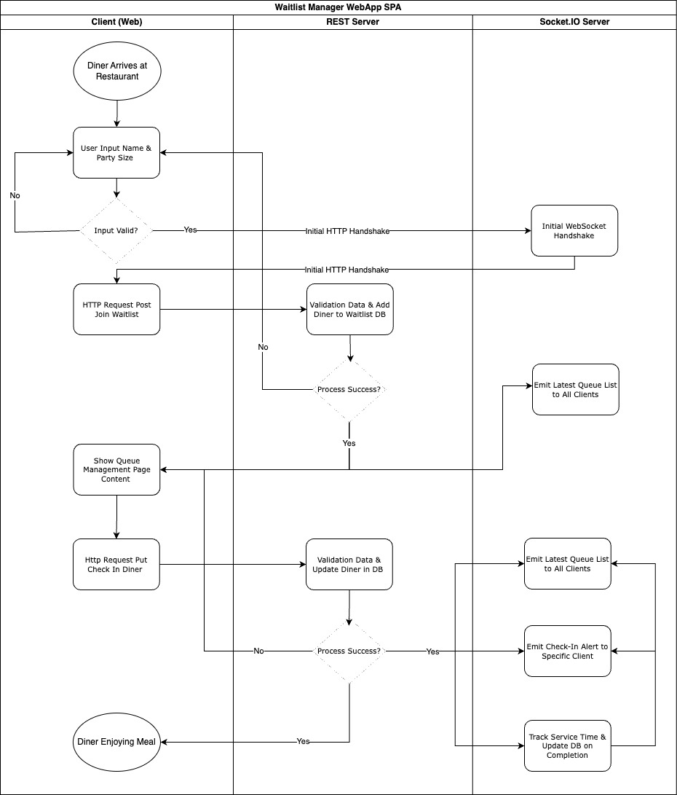

# Project Architecture

This project is structured with a clear separation between the frontend and backend components to ensure scalability, maintainability, and ease of development. I have also aimed to use a stack similar to the one used at TableCheck to demonstrate my readiness to contribute to the team. Below are the details for both parts of the system.

## 1. Frontend Architecture

### 1.1 React TypeScript with Vite

The frontend is built using React with TypeScript to ensure type safety and efficient development. Vite is used as the build tool for faster development, thanks to its quick hot module reloading and reduced build times.

### 1.2 Mobile First Approach & Emotion

The design follows a mobile-first approach to ensure responsiveness across devices. Emotion is used for styling, allowing for dynamic and scalable CSS that adapts to different screen sizes.

### 1.3 State Management with Context and Session Storage

React Context is utilized for managing state between components, while session storage ensures persistence of data. This allows multiple instances of the app to handle separate parties joining the waitlist without data loss, even after refreshes.

### 1.4 Socket.io for Real-Time Updates

Socket.io is implemented to allow real-time updates between the server and connected clients, ensuring that changes to diner queues and waitlist statuses are instantly reflected across all connected clients.

### 1.5 Cypress for End-to-End Testing

Cypress is used for end-to-end testing in the frontend to cover the functionality of the entire app. Given that this is a small-scale application with few components and no core business logic in the frontend, E2E tests are sufficient, eliminating the need for unit testing.

## 2. Backend Architecture

### 2.1 Express with TypeScript

The backend is built using Express with TypeScript to ensure simplicity, rapid development, and robustness. TypeScript adds type safety to the application, reducing runtime errors, while Express offers flexibility and performance for handling HTTP requests and middleware.

### 2.2 Docker Compose

Docker Compose is used to set up the local development environment, including the database server. It simplifies the configuration and ensures consistency across environments.

### 2.3 PostgreSQL

PostgreSQL is chosen as the database to handle potential race conditions, such as when diners check in at the last second, while the system is simultaneously processing the removal of a diner from the queue due to a timeout. PostgreSQL's ACID compliance ensures that transactions are handled correctly, maintaining data integrity even in cases where simultaneous actions might occur. While MongoDB could also be suitable, PostgreSQL's robust transaction handling makes it a reliable choice for this use case.

### 2.4 REST Server

The backend serves as a REST API, responsible for processing and validating data sent from the frontend. This ensures that all interactions between the frontend and the database are clean, secure, and validated before any data is persisted.

### 2.6 Socket.io for Real-Time Updates

Socket.io is implemented to allow real-time updates between the server and connected clients, ensuring that changes to diner queues and waitlist statuses are instantly reflected across all connected clients.

### 2.7 Jest for Unit Testing

Jest is used for unit testing critical functionality in the backend, ensuring that business logic, especially around data processing and validation, works as expected. This helps catch errors early and maintain the reliability of the application.

## 3. Cross-Functional Diagram

To provide a clearer understanding of the entire system flow, the following cross-functional diagram outlines the interactions between the frontend and backend. Here’s the diagram below:

